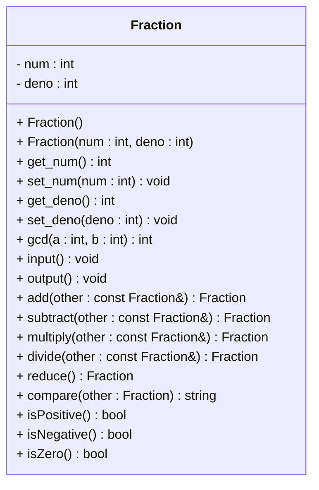

```mermaid
classDiagram
    class Fraction {
        - num : int
        - deno : int

        + Fraction()
        + Fraction(num : int, deno : int) 
        + get_num() int
        + set_num(num : int) void
        + get_deno() int
        + set_deno(deno : int) void
        + gcd(a : int, b : int) int
        + input() void
        + output() void
        + add(other : const Fraction&) Fraction
        + subtract(other : const Fraction&) Fraction
        + multiply(other : const Fraction&) Fraction
        + divide(other : const Fraction&) Fraction
        + reduce() Fraction
        + compare(other : Fraction) string
        + isPositive() bool
        + isNegative() bool
        + isZero() bool
    }
```