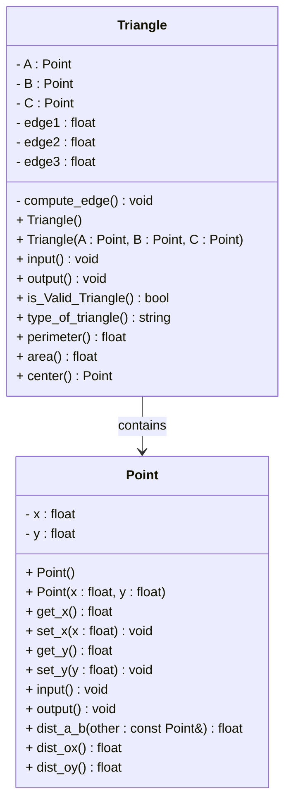

```mermaid
classDiagram
    class Point {
        - x : float
        - y : float
        
        + Point()
        + Point(x : float, y : float)
        + get_x() float
        + set_x(x : float) void
        + get_y() float
        + set_y(y : float) void
        + input() void
        + output() void
        + dist_a_b(other : const Point&) float
        + dist_ox() float
        + dist_oy() float
    }

    class Triangle {
        - A : Point
        - B : Point
        - C : Point
        - edge1 : float
        - edge2 : float
        - edge3 : float
        
        - compute_edge() void
        + Triangle()
        + Triangle(A : Point, B : Point, C : Point)
        + input() void
        + output() void
        + is_Valid_Triangle() bool
        + type_of_triangle() string
        + perimeter() float
        + area() float
        + center() Point
    }

    Triangle --> Point : contains
```