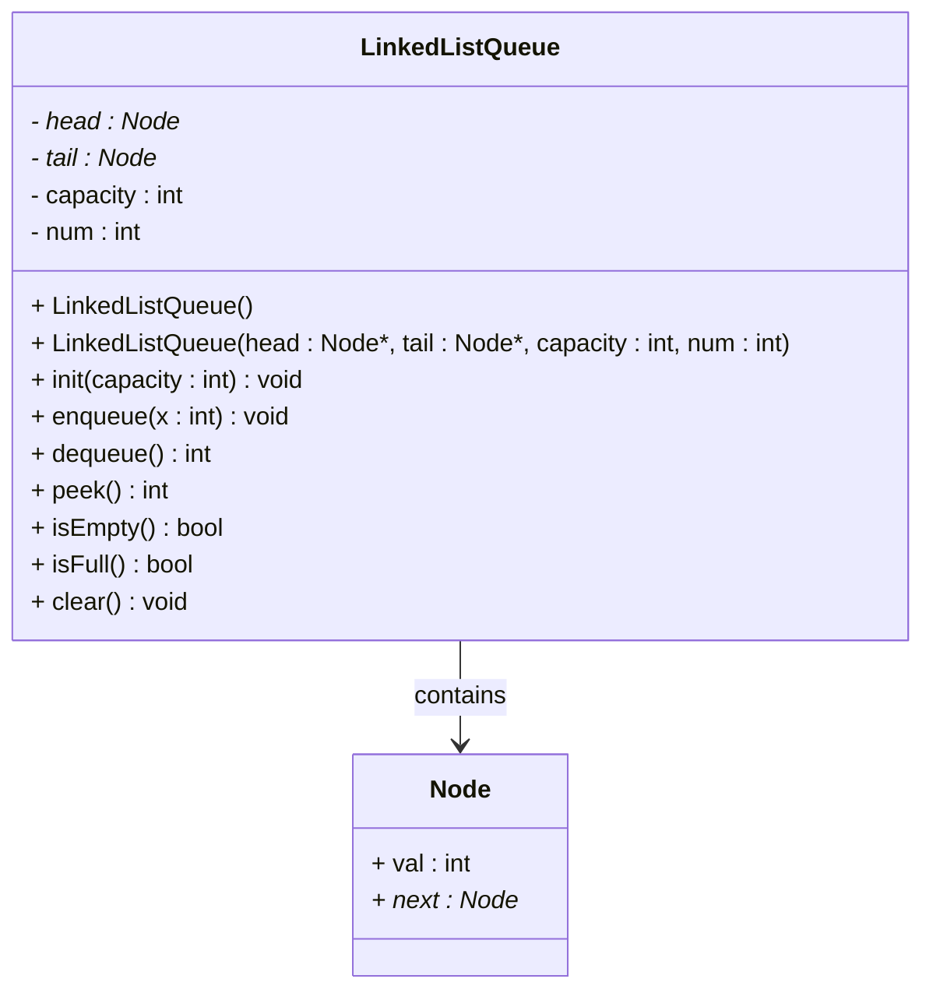

```mermaid
classDiagram
    class Node {
        + val : int
        + next : Node*
    }
    
    class LinkedListQueue {
        - head : Node*
        - tail : Node*
        - capacity : int
        - num : int
        
        + LinkedListQueue()
        + LinkedListQueue(head : Node*, tail : Node*, capacity : int, num : int)
        + init(capacity : int) void
        + enqueue(x : int) void
        + dequeue() int
        + peek() int
        + isEmpty() bool
        + isFull() bool
        + clear() void
    }
    
    LinkedListQueue --> Node : contains
```