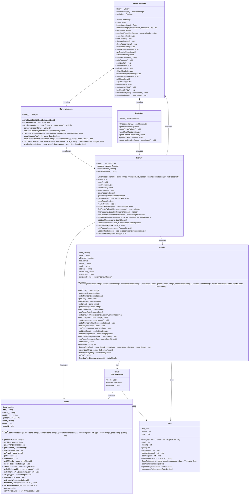

```mermaid
classDiagram

    class Book {
        - isbn_ : string
        - title_ : string
        - author_ : string
        - publisher_ : string
        - publishingYear_ : int
        - type_ : string
        - price_ : long
        - quantity_ : int

        + Book()
        + Book(isbn : const string&, title : const string&, author : const string&, publisher : const string&, publishingYear : int, type : const string&, price : long, quantity : int)
        + getISBN() const string&
        + getTitle() const string&
        + getAuthor() const string&
        + getPublisher() const string&
        + getPublishingYear() int
        + getType() const string&
        + getPrice() long
        + getQuantity() int
        + setISBN(isbn : const string&) void
        + setTitle(title : const string&) void
        + setAuthor(author : const string&) void
        + setPublisher(publisher : const string&) void
        + setPublishingYear(publishingYear : int) void
        + setType(type : const string&) void
        + setPrice(price : long) void
        + setQuantity(quantity : int) void
        + incrementQuantity(amount : int = 1) void
        + decrementQuantity(amount : int = 1) void
        + toCsv() string
        + fromCsv(csvLine : const string&) static Book
    }

    class Date {
        - day_ : int
        - month_ : int
        - year_ : int

        + Date(day : int = 0, month : int = 0, year : int = 0)
        + day() int
        + month() int
        + year() int
        + setDay(day : int) void
        + setMonth(month : int) void
        + setYear(year : int) void
        + toString(separator : char = "-") string
        + fromString(source : const string&, separator : char = "-") static Date
        + addYears(years : int) Date
        + operator<(other : const Date&) bool
        + operator==(other : const Date&) bool
    }

    class BorrowRecord {
        <<struct>>
        + book : Book
        + borrowDate : Date
        + dueDate : Date
    }

    class Reader {
        - code_ : string
        - name_ : string
        - idNumber_ : string
        - dob_ : Date
        - gender_ : string
        - email_ : string
        - address_ : string
        - createDate_ : Date
        - expireDate_ : Date
        - borrowedBooks_ : vector~BorrowRecord~

        + Reader()
        + Reader(code : const string&, name : const string&, idNumber : const string&, dob : const Date&, gender : const string&, email : const string&, address : const string&, createDate : const Date&, expireDate : const Date&)
        + getCode() const string&
        + getName() const string&
        + getIdNumber() const string&
        + getDob() const Date&
        + getGender() const string&
        + getEmail() const string&
        + getAddress() const string&
        + getCreateDate() const Date&
        + getExpireDate() const Date&
        + getBorrowedBooks() const vector~BorrowRecord~&
        + setCode(code : const string&) void
        + setName(name : const string&) void
        + setIdNumber(idNumber : const string&) void
        + setDob(dob : const Date&) void
        + setGender(gender : const string&) void
        + setEmail(email : const string&) void
        + setAddress(address : const string&) void
        + setCreateDate(createDate : const Date&) void
        + setExpireDate(expireDate : const Date&) void
        + canBorrow() bool
        + borrowedCount() int
        + borrowBook(book : const Book&, borrowDate : const Date&, dueDate : const Date&) void
        + returnBook(index : size_t) BorrowRecord
        + hasOverdue(today : const Date&) bool
        + toCsv() string
        + fromCsv(csvLine : const string&) static Reader
    }

    class Library {
        - books_ : vector~Book~
        - readers_ : vector~Reader~
        - bookFilename_ : string
        - readerFilename_ : string

        + Library(bookFilename : const string& = "listBook.txt", readerFilename : const string& = "listReader.txt")
        + load() void
        + save() void
        + loadBooks() void
        + saveBooks() void
        + loadReaders() void
        + saveReaders() void
        + getBooks() const vector~Book~&
        + getReaders() const vector~Reader~&
        + bookCount() size_t
        + readerCount() size_t
        + findBookByISBN(isbn : const string&) Book*
        + findBooksByTitle(title : const string&) vector~Book*~
        + findReaderByCode(code : const string&) Reader*
        + findReaderByIdNumber(idNumber : const string&) Reader*
        + findReadersByName(name : const std::string&) vector~Reader*~
        + addBook(book : const Book&) void
        + updateBook(index : size_t, book : const Book&) void
        + removeBook(index : size_t) void
        + addReader(reader : const Reader&) void
        + updateReader(index : size_t, reader : const Reader&) void
        + removeReader(index : size_t) void
    }

    class BorrowManager {
        - library_ : Library&

        - daysInMonth(month : int, year : int)$ int
        - isLeapYear(year : int) static bool
        - daysBetween(from : const Date&, to : const Date&) static int
        + BorrowManager(library : Library&)
        + calculateDueDate(borrowDate : const Date&) Date
        + calculateLateFee(dueDate : const Date&, actualDate : const Date&) long
        + calculateLossFee(book : const Book&) long
        + borrowBook(readerCode : const string&, bookIndex : size_t, today : const Date&) bool
        + returnBook(readerCode : const string&, borrowIndex : size_t, today : const Date&, fee : long&) bool
        + loseBook(readerCode : const string&, borrowIndex : size_t, fee : long&) bool
    }

    class Statistics {
        - library_ : const Library&

        + Statistics(library : const Library&)
        + printTotalBooks() void
        + printBooksByType() void
        + printTotalReaders() void
        + printGenderDistribution() void
        + printBooksBorrowed() void
        + printLateReaders(today : const Date&) void
    }

    class MenuController {
        - library_ : Library
        - borrowManager_ : BorrowManager
        - statistics_ : Statistics

        + MenuController()
        + run() void
        - inputCurrentDate() Date
        - readIntInRange(minValue : int, maxValue : int) int
        - readLine() string
        - readNonEmptyLine(prompt : const string&) string
        - pauseExecution() void
        - clearScreen() void
        - showMainMenu() void
        - showReaderMenu() void
        - showBookMenu() void
        - showStatisticsMenu() void
        - runReaderMenu() void
        - runBookMenu() void
        - runStatisticsMenu() void
        - printReaders() void
        - printBooks() void
        - addReader() void
        - adjustReader() void
        - deleteReader() void
        - findReaderByIdNumber() void
        - findBooksByReader() void
        - addBook() void
        - adjustBook() void
        - deleteBook() void
        - findBookByISBN() void
        - findBookByTitle() void
        - borrowBook(today : const Date&) void
        - returnBook(today : const Date&) void
    }

    %% Relationships Definition
    Library --> Book : manages
    Library --> Reader : manages
    Reader --> BorrowRecord : has
    BorrowRecord --> Book : refers to
    BorrowRecord --> Date : uses
    Reader --> Date : uses
    BorrowManager --> Library : operates on
    Statistics --> Library : analyzes
    MenuController *-- Library : contains
    MenuController *-- BorrowManager : contains
    MenuController *-- Statistics : contains

```